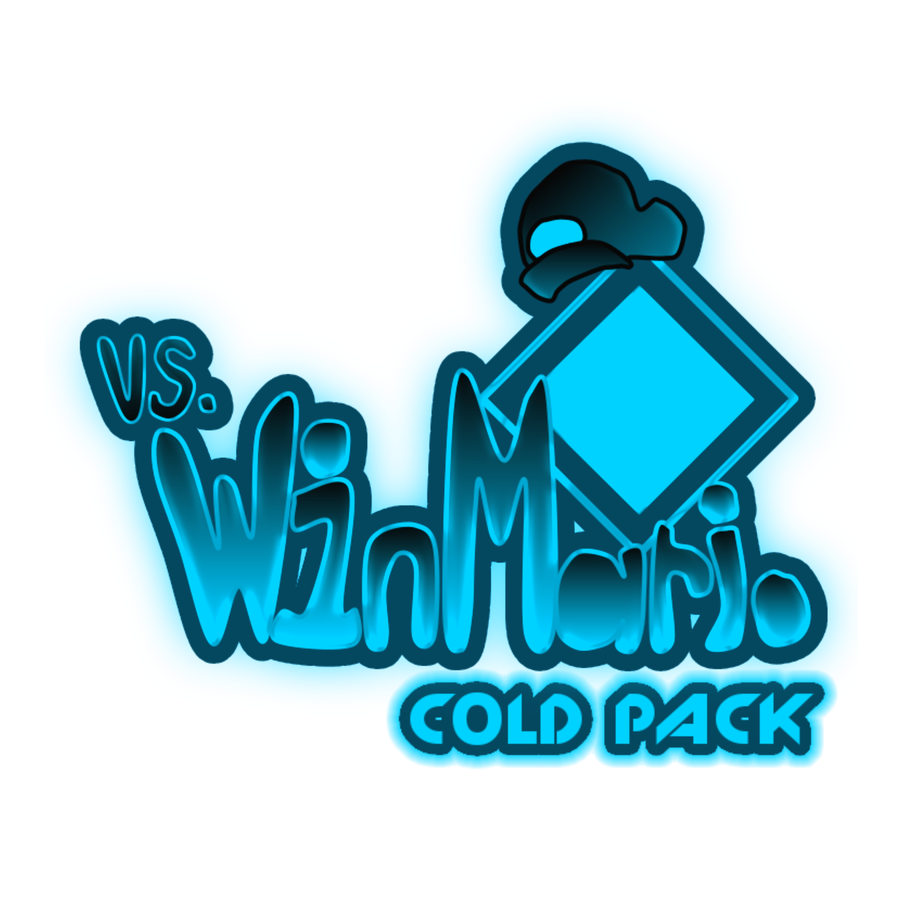
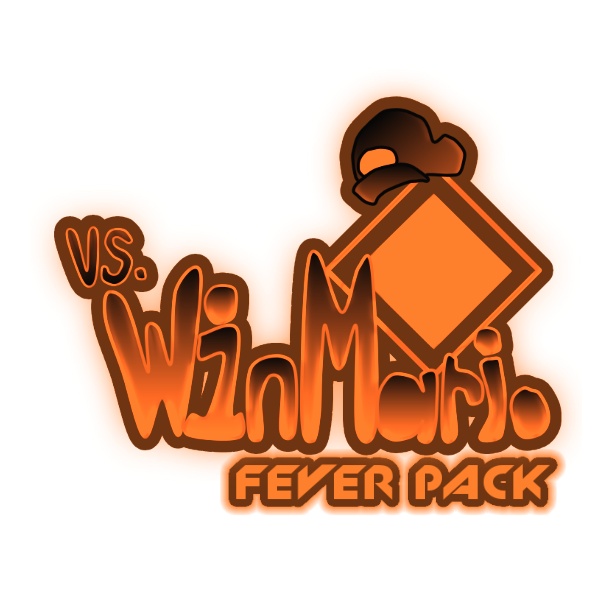
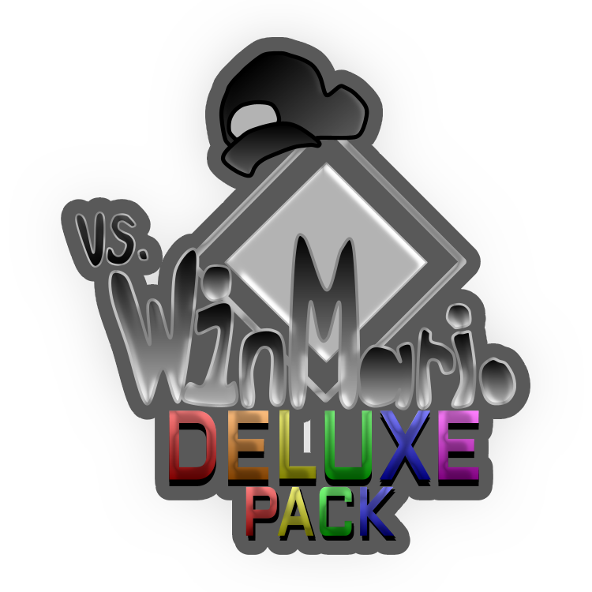
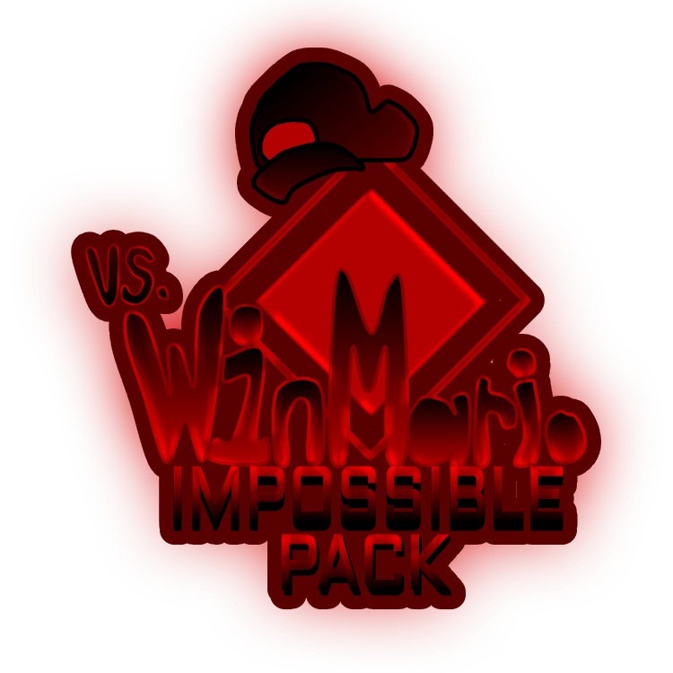

# Vs-WinMario-Addons
Just all The addons for Vs. WinMario
So... You might need Vs. WinMario is you want to use these addons.

Cold Pack Logo

Fever Pack Logo

Deluxe Pack Logo

Impossible Pack Logo

WinMario vs. WinMario Logo

BF Version Logo

Pico Version Logo

GF Version Logo

